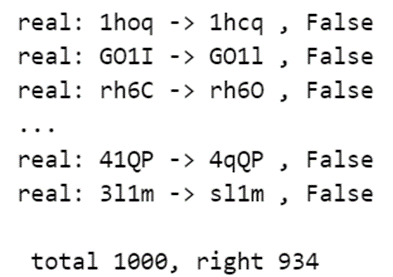
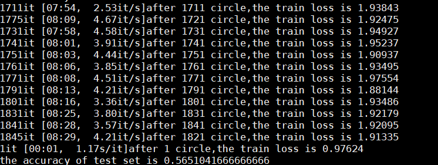
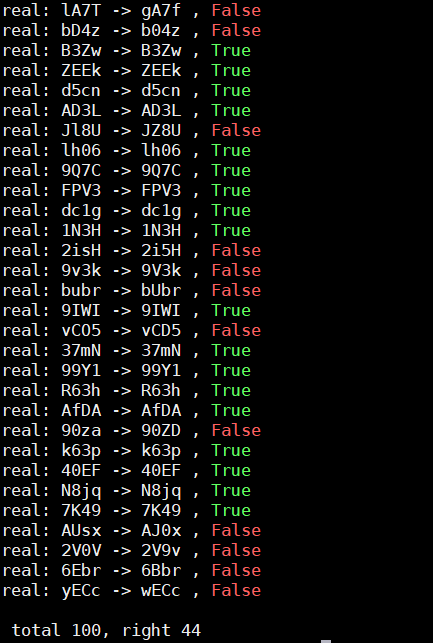

# Pytorch实现验证码识别（改进）

通过`braveryCHR/CNN_captcha`的CNN+ResNet的方法，使用自己生成的验证码数据集进行了训练和测试和验证，基本实现了验证码识别的功能。  

验证集正确率93.4%  


新生成的数据集：__*.bin__
详细实现在 __TASK3-Captcha_Recognize.ipynb__

### 修改内容
所遇到的问题及拟解决的办法：    
在实现这个验证码识别任务的过程中，因为原先代码并非十全十美且存在一点点问题，我在完成本任务的过程中，主要参考原先示例的网络构建，剩余部分按照自己思路完成。    
本任务中主要手搓了以下部分：    
1.	数据集的生成  
原先项目直接调用Captcha包生成训练数据。本实验考虑到Task之间的连续性，和验证码复杂程度，采用了`create_cap_to_file.py`生成的验证码    
  
 
2.	数据集的读入  
数据集的读入原先项目的输入部分采用了在Dataset的Captcha继承类里，一张张验证码逐个读取的IO方式，来迭代每一张图。这样的IO方式执行的都是随机读写，效率感人。  
本实现采用create_cap_to_file.py去创建一个打包好的图片np array，并且保存到本地。在训练时可以连续读入到内存中，大大优化IO效率。  
3.	其他更改  
由于修改了数据集和数据读入方式（Dataset类），本Task对训练方式和测试部分都进行了重写和修改，按照先前torch教程中比较规矩的方式来写。  


***  
以下内容来自原仓库  


### 前言

这几天主要在熟悉pyTorch，俗话说：“人生苦短，我用pyTorch”，在从TensorFlow转到pytorch之后，除了“爽”以外，我实在找不到其他形容词，简洁的语法，明了的封装，加上大大降低的debug难度，我从此入了pyTorch的坑。

为了熟悉pyTorch，我最近做了几个小项目，今天分享给大家的是一个非常有用的入门级项目——验证码识别。


### 前期准备

- core i7 的笔记本
- 一个 GTX 1080ti 的显卡
- 装上pytorch的cpu和GPU版本


### 项目目的

使用pytorch训练一个深度学习的模型来实现验证码的自动识别，其中验证码由python包cpatcha生成，其样子如下：


可以看出，该验证码识别难度较大，扭曲较为严重，如果能在该数据集上实现较高的识别率，那么其他简单的数字+字母的验证码不在话下。


### 数据生成

我使用captcha生成了训练集和测试集，其中训练集包含大约200万张图片，测试集包含一万张图片，生成代码如下：

```python
def get_string():
    string = ""
    for i in range(4):
        select = rd.randint(1, 3)
        if select == 1:
            index = rd.randint(0, 9)
            string += nums[index]
        elif select == 2:
            index = rd.randint(0, 25)
            string += lower_char[index]
        else:
            index = rd.randint(0, 25)
            string += upper_char[index]
    return string


def get_captcha(num, path):
    font_sizes = [x for x in range(40, 45)]
    for i in range(num):
        print(i)
        imc = ImageCaptcha(get_width(), get_height(), font_sizes=font_sizes)
        name = get_string()
        image = imc.generate_image(name)
        image.save(path + name + ".jpg")


if __name__ == '__main__':
    get_captcha(900000, "../data/captcha/train/")
```


### 网络定义

网络前部是卷积与池化层，网络中部是全连接层，网络最后为四个全连接层，得到四个输出，分别对应验证码中的四个数字，其定义如下：

```python
class CaptchaNet(nn.Module):
    def __init__(self):
        super(CaptchaNet, self).__init__()
        self.conv1 = nn.Conv2d(3, 5, 5)
        self.conv2 = nn.Conv2d(5, 10, 5)
        self.conv3 = nn.Conv2d(10, 16, 6)
        self.fc1 = nn.Linear(4 * 12 * 16, 512)
        self.fc2 = nn.Linear(512, 256)
        self.fc3 = nn.Linear(256, 128)
        # 这是四个用于输出四个字符的线性层
        self.fc41 = nn.Linear(128, 62)
        self.fc42 = nn.Linear(128, 62)
        self.fc43 = nn.Linear(128, 62)
        self.fc44 = nn.Linear(128, 62)

    def forward(self, x):
        # 输入为3*128*64，经过第一层为5*62*30
        x = F.max_pool2d(F.relu(self.conv1(x)), (2, 2))
        # 输出形状10*29*13
        x = F.max_pool2d(F.relu(self.conv2(x)), (2, 2))
        # 输出形状16*12*4
        x = F.max_pool2d(F.relu(self.conv3(x)), (2, 2))
        # print(x.size())
        x = x.view(-1, 768)
        x = self.fc1(x)
        x = F.relu(x)
        x = self.fc2(x)
        x = F.relu(x)
        x = self.fc3(x)
        x = F.relu(x)
        x1 = self.fc41(x)
        x2 = self.fc42(x)
        x3 = self.fc43(x)
        x4 = self.fc44(x)
        return x1, x2, x3, x4
```

后来使用ResNet进行改进模型，其网络结构如下

```python
class ResidualBlock(nn.Module):
    def __init__(self, inchannel, outchannel, stride=1):
        super(ResidualBlock, self).__init__()
        self.left = nn.Sequential(
            nn.Conv2d(inchannel, outchannel, kernel_size=3, stride=stride, padding=1, bias=False),
            nn.BatchNorm2d(outchannel, track_running_stats=True),
            nn.ReLU(inplace=True),
            nn.Conv2d(outchannel, outchannel, kernel_size=3, stride=1, padding=1, bias=False),
            nn.BatchNorm2d(outchannel, track_running_stats=True)
        )
        self.shortcut = nn.Sequential()
        if stride != 1 or inchannel != outchannel:
            self.shortcut = nn.Sequential(
                nn.Conv2d(inchannel, outchannel, kernel_size=1, stride=stride, bias=False),
                nn.BatchNorm2d(outchannel, track_running_stats=True)
            )

    def forward(self, x):
        out = self.left(x)
        out += self.shortcut(x)
        out = F.relu(out)
        return out


class ResNet(nn.Module):
    def __init__(self, ResidualBlock, num_classes=62):
        super(ResNet, self).__init__()
        self.inchannel = 64
        self.conv1 = nn.Sequential(
            nn.Conv2d(3, 64, kernel_size=3, stride=1, padding=1, bias=False),
            nn.BatchNorm2d(64, track_running_stats=True),
            nn.ReLU(),
        )
        self.layer1 = self.make_layer(ResidualBlock, 64, 2, stride=1)
        self.layer2 = self.make_layer(ResidualBlock, 128, 2, stride=2)
        self.layer3 = self.make_layer(ResidualBlock, 256, 2, stride=2)
        self.layer4 = self.make_layer(ResidualBlock, 512, 2, stride=2)
        self.fc1 = nn.Linear(512, num_classes)
        self.fc2 = nn.Linear(512, num_classes)
        self.fc3 = nn.Linear(512, num_classes)
        self.fc4 = nn.Linear(512, num_classes)

    def make_layer(self, block, channels, num_blocks, stride):
        strides = [stride] + [1] * (num_blocks - 1)  # strides=[1,1]
        layers = []
        for stride in strides:
            layers.append(block(self.inchannel, channels, stride))
            self.inchannel = channels
        return nn.Sequential(*layers)

    def forward(self, x):
        x = self.conv1(x)
        x = self.layer1(x)
        x = self.layer2(x)
        x = self.layer3(x)
        x = self.layer4(x)
        x = F.avg_pool2d(x, 4)
        x = x.view(-1, 512)
        y1 = self.fc1(x)
        y2 = self.fc2(x)
        y3 = self.fc3(x)
        y4 = self.fc4(x)
        return y1, y2, y3, y4
```

在ResNet下，正确率可以超过90%。


### 训练结果

在20万张图片训练情况下，可以达到35%的准确率。

在200万张图片训练情况下，可以达到55%——60%的准确率。

如果继续加深网络层数，以及扩展训练集数目，根据估算，在1000万训练集情况下，可以达到90%以上的准确率。




### 测试

手写一个100张图片的数据集进行测试，可以发现如下规律：



- 确实可以达到近50%的准确率，对于这种较为难以辨认的验证码而言，效果已经不错
- 错误很多都是较为相近的字母或者数字，例如
    - s -> 5
    - o -> 0
    - E -> B


### 使用方法

- python main.py 可以对模型进行训练
- python userTest.py 可以对userTest文件下下的图片进行辨认

- python generate_captcha.py 可以生成验证码